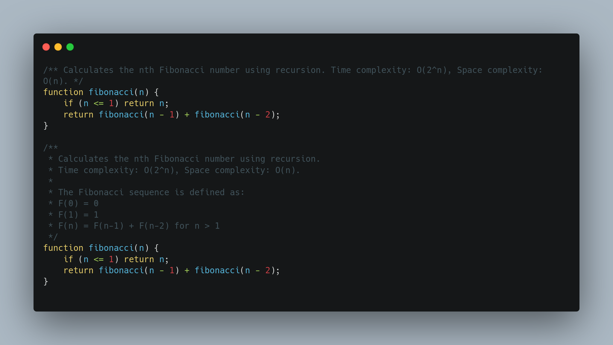
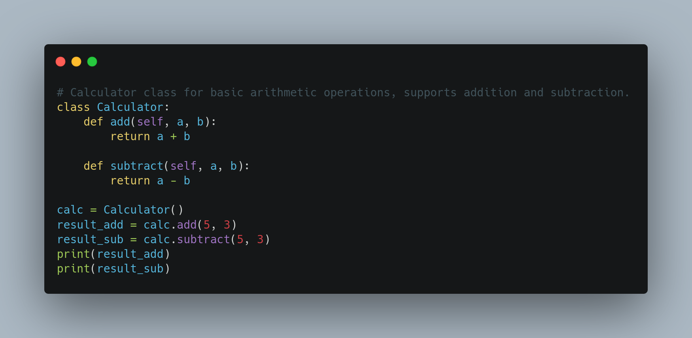

# commentov1

 
 

## Table of Contents
- [Introduction](#introduction)
- [Features](#features)
- [Prerequisites](#prerequisites)
- [Installation and Setup](#installation-and-setup)
- [Using Commento](#using-commento)
- [Example Usage](#example-usage)
- [Keyboard Shortcuts](#keyboard-shortcuts)
- [Configuration](#configuration)
- [Known Issues](#known-issues)
- [Release Notes](#release-notes)
- [Change Log](#change-log)
- [Open Source Contribution](#open-source-contribution)
- [License](#license)

## Introduction
Commento is a VS Code extension that generates concise and detailed comments for your code using Google Gemini AI. This documentation will guide you through the setup and usage of the extension.

## Features
- AI-powered comment generation using Google Gemini AI.
- Supports both concise and detailed comment styles.
- Easy integration with VS Code through command palette shortcuts.
- Option to include usage examples in detailed comments.
- Works with multiple programming languages.
- Open-source.

## Prerequisites
- A valid Google Gemini API key
- VS Code installed on your system

## Installation and Setup
1. **Obtain API Key:** Get your API key from Google Gemini at [Google AI Studio](https://aistudio.google.com/app/apikey).
2. **Configure API Key in VS Code:**
   - Open VS Code.
   - Click on the gear icon ⚙ in the lower left corner, then go to **Settings** (`Ctrl + ,` on Windows/Linux, `Cmd + ,` on Mac).
   - In the search bar at the top, type `Commento`.
   - Click on **Commento** in the Extensions section.
   - Paste your API key into the provided field.
   - Enable the checkbox **"Include usage examples in detailed comments"** if you want generated comments to include examples.

## Using Commento
### Generating Comments
1. Select the function, class, or block of code where you want to generate comments.
2. Press `Ctrl + Shift + P` to open the command palette.
3. Type `> Commento:` and select one of the following commands:
   
   - **Commento: Concise Comment** – Generates a short, one-line comment explaining the purpose of the selected code.
   - **Commento: Detailed Comment** – Generates a more comprehensive, multi-line comment describing the functionality, parameters, and possible outcomes of the code.

## Example Usage

## Keyboard Shortcuts
- `Ctrl + Shift + P` → Open Command Palette
- `Ctrl + ,` (Windows/Linux) / `Cmd + ,` (Mac) → Open Settings

## Configuration
You can configure Commento settings in VS Code:
- `commento.apiKey`: Your Google Gemini API key.
- `commento.includeExamples`: Enable/Disable usage examples in detailed comments.

## Known Issues
- **Missing API Key:** If you forget to add your Google Gemini API key, the extension will not function correctly. Make sure to follow the setup steps and verify that your API key is correctly entered in the settings.

## Release Notes
**Beta Version:** Commento is currently in beta, and we are actively working on improvements. Feedback and bug reports are welcome!

### Version 1.1.2
- Improved user experience with a more intuitive interface.
- Enhanced comment generation for better clarity and accuracy.
- Added an option in settings to **Include usage examples in detailed comments**.
- Minor bug fixes and performance optimizations.

## Change Log
- **v1.1.3:** Improved UI, better comments, added example checkbox.
- **v1.1.1:** Fixed API key validation issue.
- **v1.1.0:** Initial public beta release.

## Open Source Contribution
This project is open-source! If you would like to contribute, check out the following links:
- GitHub Repository: [Commento on GitHub](https://github.com/RoyRoki/commento.git)
- VS Code Marketplace: [Commento Extension](https://marketplace.visualstudio.com/items?itemName=rokiroy.commento)

## License
This project is licensed under the MIT License. See the LICENSE file for details.

## Conclusion
Commento helps streamline code documentation by generating meaningful comments quickly. Use `concise` for short explanations and `detailed` for in-depth documentation.

---
🚀 Made with Rocket Coding
